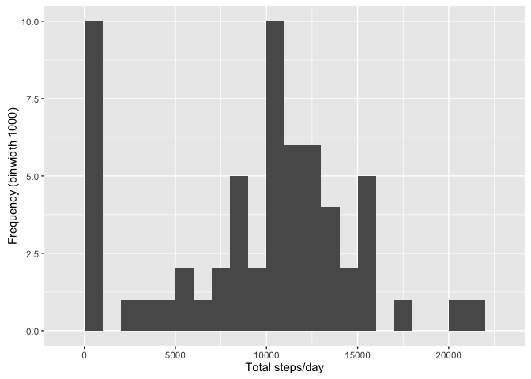
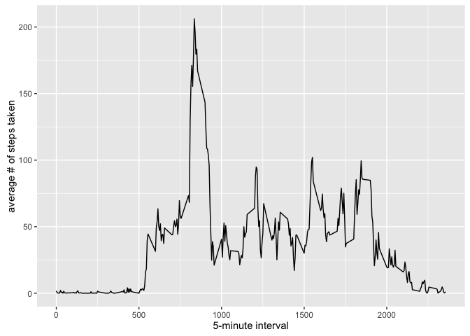
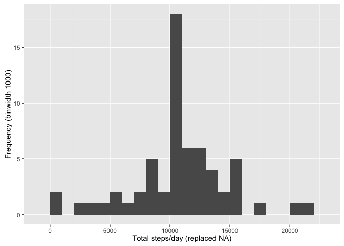
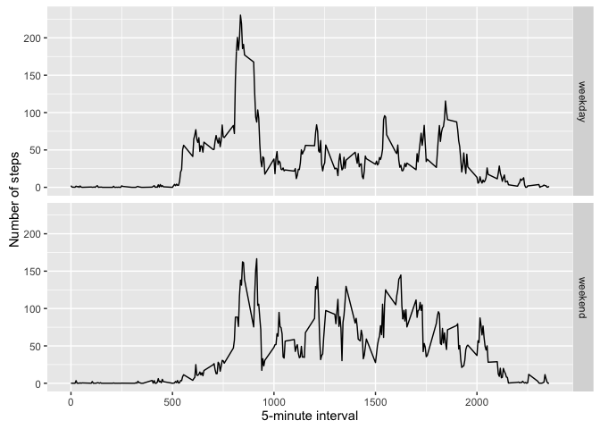

# Reproducible Research: Peer Assessment 1

load necessary libraries:

```r
library(ggplot2)
```

## Loading and preprocessing the data

```r
if(!file.exists("activity.csv")){
    unzip("activity.zip")
}
data <- read.csv("activity.csv")
```

## What is mean total number of steps taken per day?
* The total number of steps taken per day calculates as follows:

```r
stepsPd <- tapply(data$steps, data$date, sum, na.rm=TRUE)
```

* Plot a histogram (using `ggplot2`) displaying the total number of steps taken each day

```r
qplot(stepsPd, xlab='Total steps/day', ylab='Frequency (binwidth 1000)', binwidth=1000)
```

<!-- -->

* Mean and Median of the total number of steps taken per day is:

```r
stepsPdMean <- mean(stepsPd)
stepsPdMedian <- median(stepsPd)
```
Mean: 9354   
Median: 10395

## What is the average daily activity pattern?

```r
averages <- aggregate(x=list(steps=data$steps), by=list(interval=data$interval), FUN=mean, na.rm=TRUE)
```

* Time series plot of the 5-minute interval and the average number of steps taken (averaged across all days)

```r
g <- ggplot(data=averages, aes(x=interval, y=steps)) 
g + geom_line() + xlab("5-minute interval") + ylab("average # of steps taken")
```

<!-- -->

* 5-minute interval containing the maximum number of steps across all days in the dataset:

```r
averageMax <- averages[which.max(averages$steps),]
```
The maximum number of steps **206.17** averaged over all days in the datasets occurs during the interval **835**.

## Imputing missing values
* Calculate total number of missing values in the dataset

```r
missingV <- which(is.na(data$steps))
numMissingV <- length(missingV)
```

Number of missing values in the dataset: **2304**

* Fill in all of the missing values:

Fill all the missing values with the mean value for that 5-minute interval, calculated above. (See *"What is the average daily activity pattern?"*) Save the dataset with replaced NA values in the same format as the original.

```r
# replacing the missing values
replaceNA <- function(steps, interval) {
    fill <- NA
    if (!is.na(steps)){ 
        fill <- c(steps)
    } else {
        fill <- (averages[averages$interval == interval, "steps"])
    }
    return(fill)
}
repldata <- data
repldata$steps <- mapply(replaceNA, repldata$steps, repldata$interval)
```
* Plot new histogram and calculate new mean/median:  
Plot new histogram with the total number of steps taken each day with the new dataset. 


```r
replstepsPd <- tapply(repldata$steps, repldata$date, FUN = sum)
qplot(replstepsPd, binwidth = 1000, xlab='Total steps/day (replaced NA)', ylab='Frequency (binwidth 1000)')
```

<!-- -->

Calculate the new values for mean an median total number of steps taken per day.   

```r
replstepsPdMean <- mean(replstepsPd)
replstepsPdMedian <- median(replstepsPd)
```
Mean: 1.0766189\times 10^{4}   
Median: 1.0766189\times 10^{4}  

```r
#disable scientific notation for easier comparison to previous numbers
options(scipen = 999)
```
with omitted NA vs. replaced NA  
Mean   : 9354 vs. 10766  
Median : 10395 vs. 10766    
In comparison to the values for the uncorrected dataset, both values are higher.      

## Are there differences in activity patterns between weekdays and weekends?
Check if date is a weekday or weekend with the `weekdays()` function and append column to dataset. (note: language setting is German)

```r
repldata$weekd <-  ifelse(weekdays(as.POSIXlt(repldata$date),TRUE) %in% c("Sa","So"), "weekend", "weekday")
```
Make a panel plot containing a time series plot of the 5-minute interval and the average number of steps taken averaged across all weekdays or weekend days.  

```r
averages2 <- aggregate(steps ~ interval + weekd, data = repldata, mean)
g2 <- ggplot(averages2, aes(interval, steps)) 
g2 + geom_line() + facet_grid(weekd ~ .) + xlab("5-minute interval") + ylab("Number of steps")
```

<!-- -->


